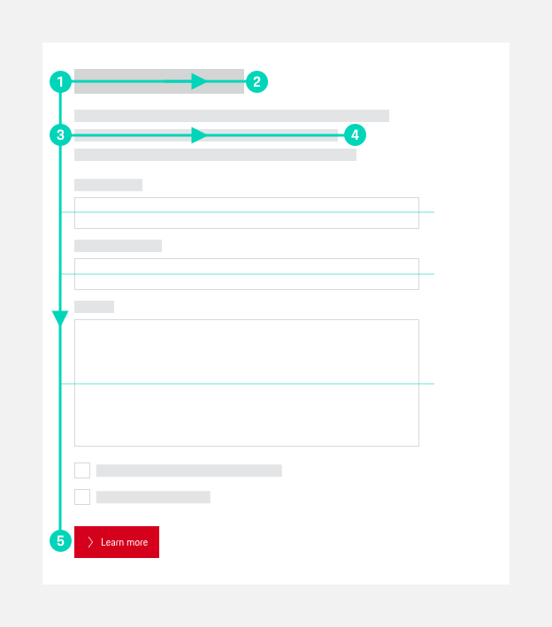
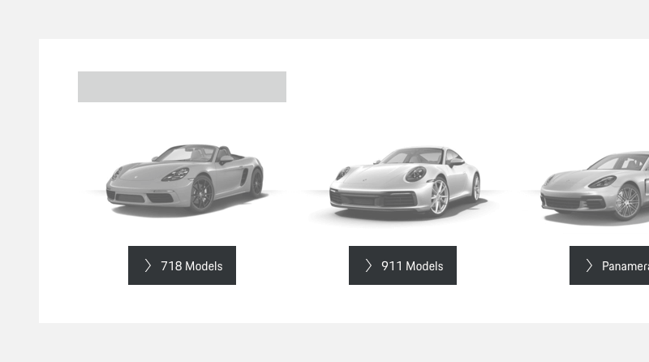
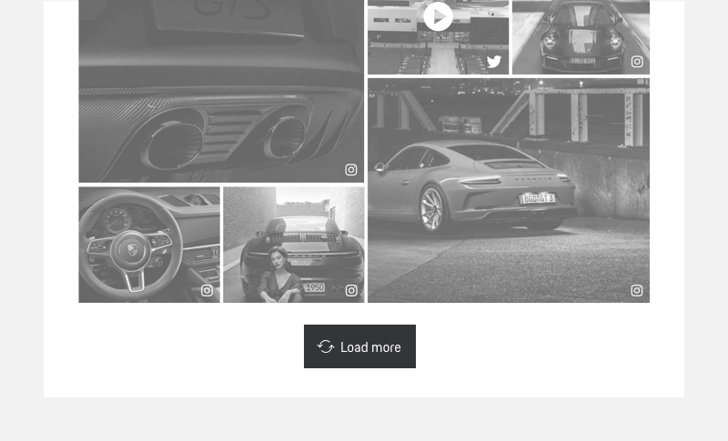
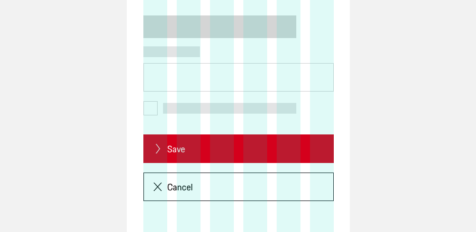

# Button

<TableOfContents></TableOfContents>

## When to use

- Use a Button to enable to execute an action (like "submit", "delete", "add" or "edit").
- Use a Button to change the state of an application, which almost always happens on the same page.

---

## Types

To ensure a seamless UX in all Porsche web applications it is recommended to use the Button as follows

| Type      | Usage                                                                                                                                                                                                                                                                                                                                                                                                                               |
| --------- | ----------------------------------------------------------------------------------------------------------------------------------------------------------------------------------------------------------------------------------------------------------------------------------------------------------------------------------------------------------------------------------------------------------------------------------- |
| Primary   | The Button filled with the Porsche brand color. This type is only to be used for one or two first priority actions within a page in order to give the user optimal guidance.                                                                                                                                                                                                                                                        |
| Secondary | Default button with monochrome color fill. To be used for all other stand-alone Buttons that aren't high priority.                                                                                                                                                                                                                                                                                                                  |
| Tertiary  | An "outline only" version of the Porsche Button. In hierarchy it is always subordinated to the filled views and can be used in two different cases: 1. In combination with a filled Button (Primary or Secondary), for example in popular pairings such as "submit" (Primary or Secondary) and "cancel" (Tertiary). 2. Stand-alone, when the priority of the action is lower compared to all other Button actions within this page. |

| Variant       |                                                                                                                                                                                                                                                                                   |
| ------------- | --------------------------------------------------------------------------------------------------------------------------------------------------------------------------------------------------------------------------------------------------------------------------------- |
| Icon and text | This should be the variant of your choice whenever possible, as icons should preferably always be paired with text for better comprehensibility and accessibility. The length of the Button always adapts to the length of the text label.                                        |
| Icon only     | This variant contains an icon only with no further text information. It is highly recommended to use it only in cases where the user is fully aware of the button function. This can be ensured e.g. by using an expressive icon or by logical composition with other components. |

## Usage

### Standard icons

The default icon is an arrow right that should serve in most cases. It should be changed only if it is ensured that
another symbol is more appropriate to support the text content, making it easier for the user to understand the function
quickly. For example:

| Interaction | Icon                                                            | Example                                       |
| ----------- | --------------------------------------------------------------- | --------------------------------------------- |
| Close       | <p-icon name="close" aria="{'aria-label': 'Close'}"></p-icon>   | Close a current page or window.               |
| Cancel      | <p-icon name="close" aria="{'aria-label': 'Close'}"></p-icon>   | Abandoning a process.                         |
| Delete      | <p-icon name="delete" aria="{'aria-label': 'Delete'}"></p-icon> | Delete/erase content, e.g. a list item.       |
| Edit        | <p-icon name="edit" aria="{'aria-label': 'Edit'}"></p-icon>     | Edit content, e.g. in lists or shop checkout. |
| Add         | <p-icon name="add" aria="{'aria-label': 'Add'}"></p-icon>       | Add content, e.g. a new item in a list.       |

### Text label

The text label is always set in copytext size. It is recommended to always keep the label short and give the user a hint
on the indicated action, for example by including active verbs such as "add", "edit" or "delete".

### Alignment

#### **1. Left alignment (F-shaped reading pattern)**

Buttons **on standard pages or in on-page forms** are recommended to be placed **left-justified**, supporting a direct
user attention flow:

This is based on the
[F-shaped reading pattern](https://www.nngroup.com/articles/f-shaped-pattern-reading-web-content-discovered/) which is
still followed by the majority of users on common web pages both on mobile and desktop
([Nielsen Norman](https://www.nngroup.com/articles/f-shaped-pattern-reading-web-content/), 2017) and has also been
proven in a usability study on forms [by Luke Wroblewski](https://www.lukew.com/ff/entry.asp?571) (2007).

#### **2. Centered alignment**

**In exceptional cases** it's even possible to place Buttons **centered** to their related content:

If the Button centring contributes to a more aesthetically pleasing look and feel, like, for example, in an image slider
where the Buttons should be placed centered to the images:

 If the Button relates to a
larger part or even the whole page, e.g. a "Load more" Button:

#### **3. Smaller viewports**

On smaller viewports up to 479 px screen width Buttons are always to be placed stacked and full-width. This makes it
easier for the user to tap due to a larger visible touch area and also allows to give primary actions more visibility.
"Icon only" Buttons keep their fix size on all viewports.

### Multi-line Buttons

Though it's technically possible to use multiline text in Porsche Buttons, it's recommended to keep the Button label
short and, therefore, avoid multiline Buttons.

    <p-heading variant="heading-3" tag="h3" style="margin-bottom: 24px;">Examples</p-heading>
    

## Do's & Don'ts

### Mixed usage of Button variants

It is not recommended to use "icon and text" and "icon only" Button variants in direct combination. Always try to stick
to a homogeneous usage of Button variants in favour of a seamless UX.

---

## Related components

- [Button Group](components/button-group)
- [Links](components/link)
